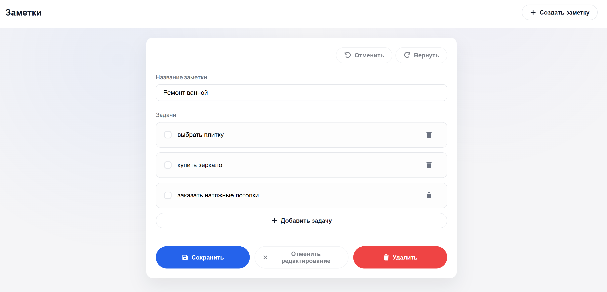
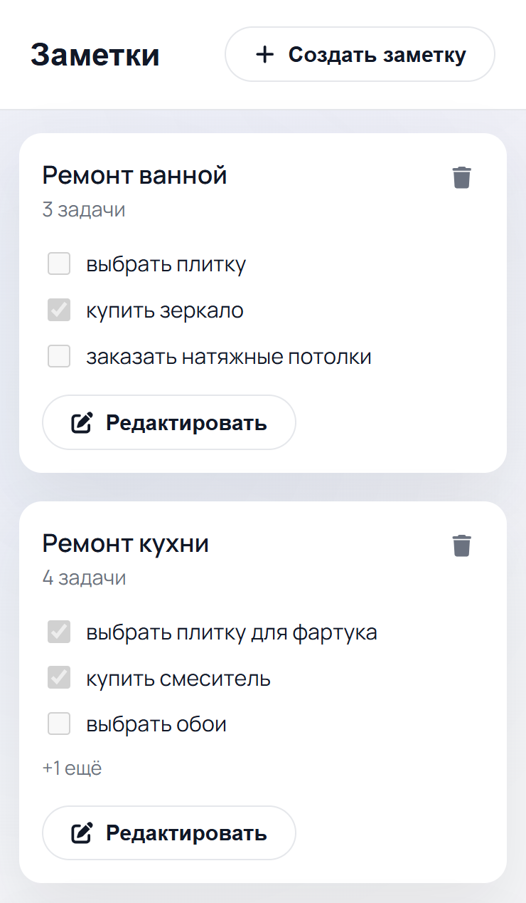

# Notes (Nuxt 3 SPA)

Небольшое SPA на Nuxt 3.20.x для заметок с задачами. Pinia хранит данные и синхронизирует их в `localStorage`, undo/redo работает в редакторе, все подтверждения через модальные окна. SSR отключён.

## Запуск (npm)
```bash
npm install
npm run dev -- --host 0.0.0.0 --port 3000
```
Открыть: http://localhost:3000/notes

## Запуск через Docker
```bash
docker-compose up --build
```
После сборки приложение доступно на http://localhost:3000/notes. Остановить Ctrl+C, очистить `docker-compose down`.

## Скриншоты
### Десктоп — список


### Десктоп — редактор


### Мобильная версия


## Архитектура
- `layouts` — общий каркас (хедер + кнопка создания).
- `pages` — `/notes`, `/notes/new`, `/notes/:id`.
- `app/components/*` — атомы/молекулы/организмы (кнопки, инпуты, модалка, карточка, список, редактор, todo-элемент).
- `stores/notes.ts` — Pinia + `localStorage` со стартовыми русскими данными.
- `composables/useNoteEditor.ts` — черновик и стек undo/redo.
- `assets/styles/main.scss` — SCSS, BEM.

## Поведение
- Сохранение недоступно, если заголовок пуст или есть пустые задачи.
- «Отменить редактирование» отключена, пока нет изменений; удаление/отмена через модалки, Esc закрывает.
- Добавление задачи сразу фокусирует поле.
- Header-клик «Заметки» ведёт на список.
